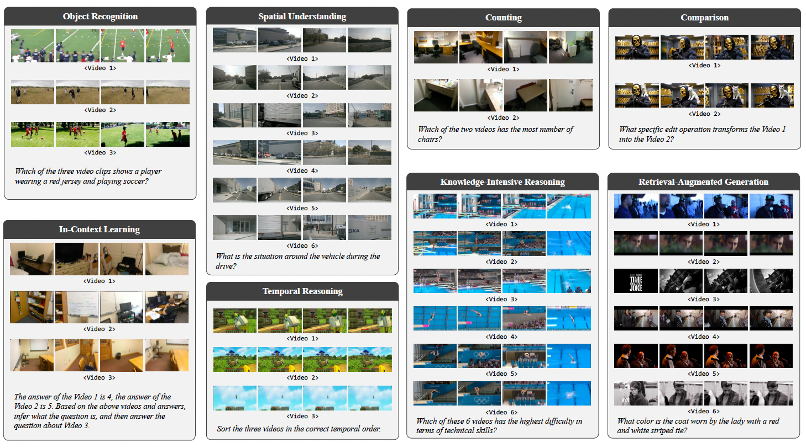
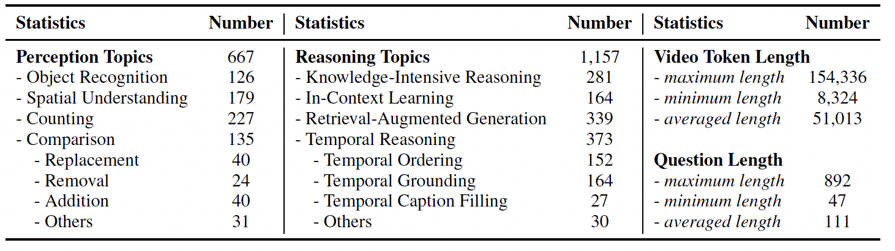
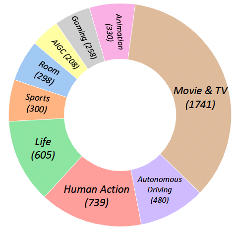
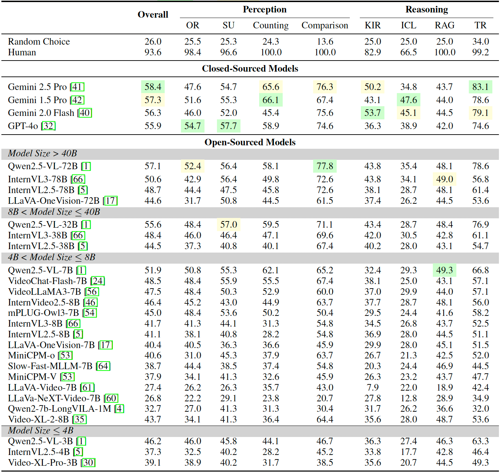
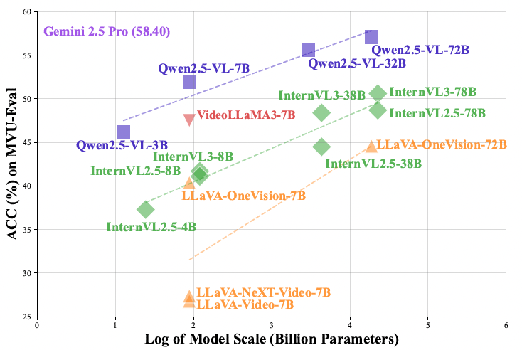

<!--
 * @Author: Tianhao Peng pengtianhao@buaa.edu.cn
 * @Date: 2025-10-22 10:30:13
 * @LastEditors: Tianhao Peng pengtianhao@buaa.edu.cn
 * @LastEditTime: 2025-10-31 22:44:30
 * @FilePath: /MVU-Eval/README_zh.md
 * @Description: None
-->

  <h1>
     
    MVU-Eval： 
    面向多视频理解的多模态大语言模型评测基准
  </h1>

  

    
    
    
    
  

  

    <a href="README.md">English</a> | <a href="README_zh.md">中文</a>
  

---

## 📋 摘要（Abstract）

多模态大语言模型（Multimodal Large Language Models, MLLMs）的发展极大拓展了人工智能在视觉模态下的能力，  
然而现有视频理解基准大多仅限于**单视频理解**，无法反映真实场景中对**多视频综合理解**的需求。  

为此，我们提出了 **MVU-Eval** —— 首个面向多模态大语言模型的**多视频理解综合评测基准**。  

MVU-Eval 共包含 **1,824 条精心构建的问答样本**，覆盖来自多个领域的 **4,959 个视频**，  
同时评测模型在基础感知与高阶推理两大层面的综合能力。  
它从八个核心维度评估模型的多视频理解能力：  
**对象识别（Object Recognition）**、**空间理解（Spatial Understanding）**、**计数（Counting）**、**比较（Comparison）**、  
**知识密集型推理（Knowledge-Intensive Reasoning）**、**上下文学习（In-Context Learning）**、  
**检索增强生成（Retrieval-Augmented Generation）**、以及**时间推理（Temporal Reasoning）**。

  
   
  <em>图 1：MVU-Eval 中的典型多视频理解任务示例。</em>

---

## 🌟 核心特性（Key Features）

- **🎯 全球首个多视频理解评测基准**  
  覆盖 8 大任务类型，共 1,824 个 QA 样本与 4,959 个视频，实现从感知到推理的全面评估。

- **🧩 八项核心能力评估**  
  包括对象识别（OR）、空间理解（SU）、计数、比较、知识密集型推理（KIR）、上下文学习（ICL）、  
  检索增强生成（RAG）以及时间推理（TR）。

- **⚙️ 严谨的数据构建流程**  
  结合自动化问答生成、双轮人工校验与泄露检测机制，确保数据高质量与高可靠性。

- **📊 系统化模型评测**  
  涵盖 30+ 开源与闭源多模态大模型（如 Gemini 2.5 Pro、GPT-4o、Qwen 2.5-VL、InternVL 3 等），揭示多视频理解的显著性能差距。

---

## 📈 数据统计

  

  

---

## 实验结果

  

  

